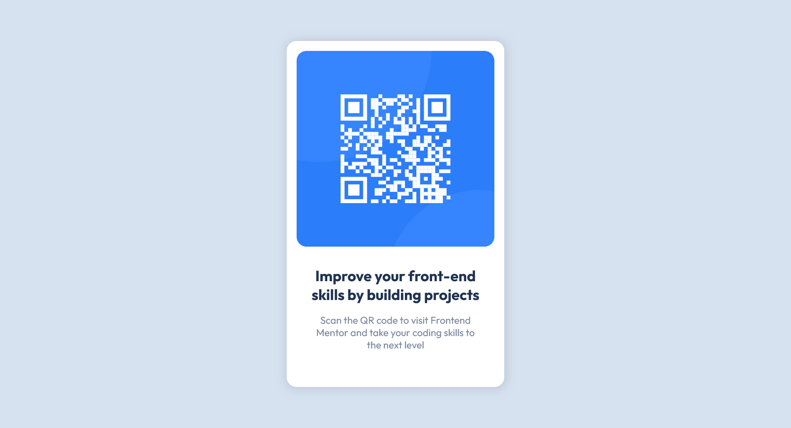

# Frontend Mentor - QR code component solution

This is a solution to the [QR code component challenge on Frontend Mentor](https://www.frontendmentor.io/challenges/qr-code-component-iux_sIO_H). Frontend Mentor challenges help you improve your coding skills by building realistic projects. 

## Table of contents

- [Overview](#overview)
  - [Screenshot](#screenshot)
  - [Links](#links)
  - [Built with](#built-with)
  - [What I learned](#what-i-learned)
  - [Continued development](#continued-development)

**Note: Delete this note and update the table of contents based on what sections you keep.**

## Overview
 
This is a simple QR code website. The idea is to train the skills of HTML and CSS.

### Screenshot

This is the desktop version

This is the mobile version

### Links

- Solution URL: 

### Built with

- Semantic HTML5 markup
- CSS custom properties
- Flexbox

### What I learned

Flexbox and its behavior were a significant learning experience for me in this project. I also gained knowledge about the significance of using semantic HTML tags.

### Continued development

For future projects, I want to improve my skills in using grids and flexbox in CSS. To make the website more interactive, I intend to use JavaScript.

